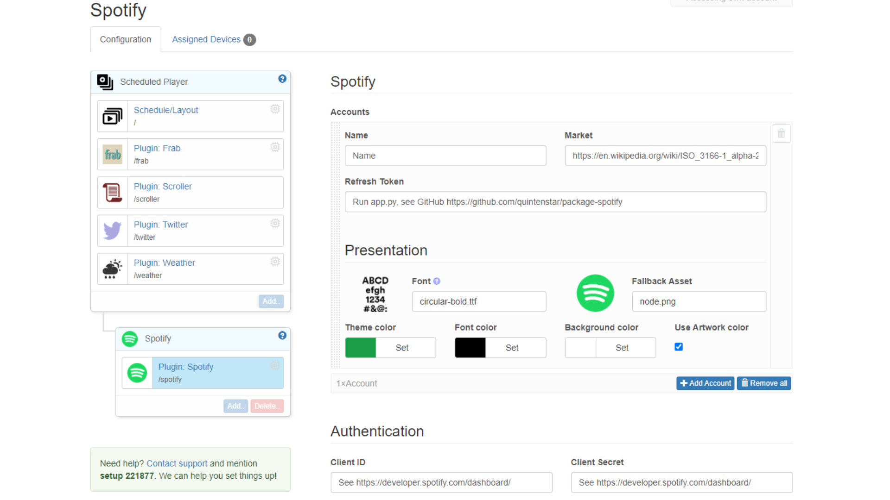
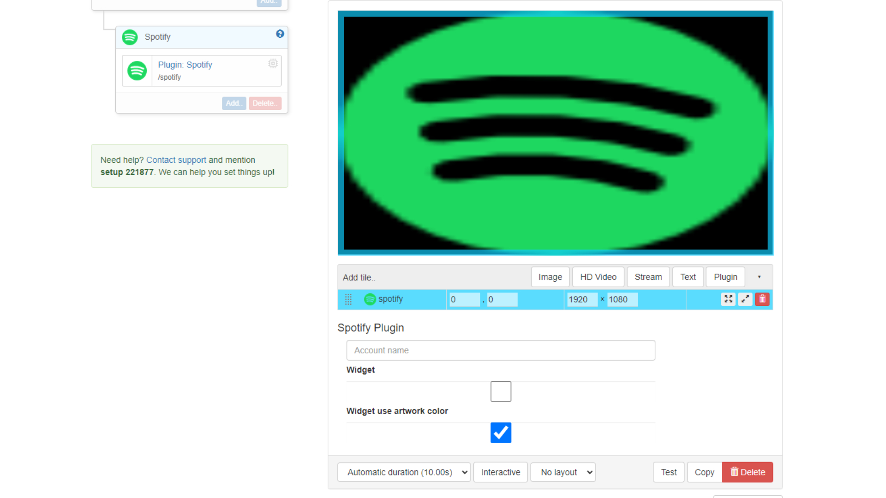

# Spotify info-beamer package

[](https://info-beamer.com/use?url=https://github.com/quintenstar/package-spotify.git)

This package allows you to display the current playing Spotify track.

Notable features:

- Works with multiple accounts within the same info-beamer setup.
- Dynamic artwork background color.
- Fullscreen and widget mode.
- Currently, it only works as a subpackage of the Scheduled Player package. But this can be dropped in the future.

## Installation

### Spotify developer account

- Create a [Spotify developer account and a new app](https://developer.spotify.com/dashboard).
- Get both the Client ID and Client Secret for the next step.
- Add `http://localhost:5000/callback` and/or `http://127.0.0.1:5000/callback` to the redirect URIs.

### Run app.py

Create a .env file in the project root folder and fill in the Client ID, Client Secret and [market](https://en.wikipedia.org/wiki/ISO_3166-1_alpha-2).

Run in root project folder and login for each of your Spotify accounts to generate a refresh token.

```console
python -m flask run
```

### Info-beamer website

- Add the Spotify package to info-beamer]
- Add it as a plugin to the [Scheduled Player](https://info-beamer.com/package/7583l) package.

https://info-beamer.com/package/7583

- Fill in the Client ID, Client secret under authentication in the plugin settings.
- Add an account, give it a name and set the market and refresh token.
- On a Scheduled Player page add the Spotify Plugin and give it the same name (under the tile options).

## Settings


Above an example of the display of 2 separate Spotify accounts. Both using the artwork background color option. One the normal (fullscreen) mode and the other the widget mode, which is optimized for smaller screen space.



You can add as many accounts as you would like. The limiting factor will be mostly the capabilities of your Raspberry Pi or Spotify developer mode API quotas.

At the moment the `theme color` and `fallback asset` options are not being used.

Setting the `use artwork color` option will dynamically set the background color based on the dominant track artwork color.



Make sure the `account name` is matching with the general package settings.

When selecting the widget option if you don't tick the `widget use artwork color` option it defaults back to the `background color` option set in the general package settings.

## Changelog

### Version 0.1.0

- Initial release
